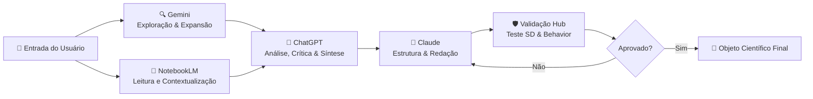
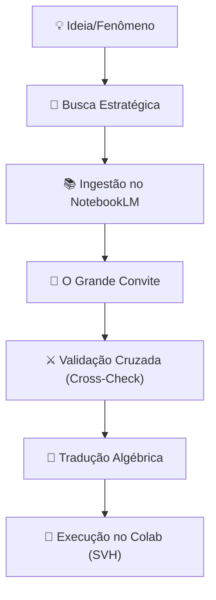

# 🚀 Linguistic Laboratory Framework

> **Um laboratório federado, gratuito e acessível para experimentação linguística, IA semântica e análise científica.**
> Integra metodologia de pesquisa multi-LLM com ferramentas de validação rigorosa (Rigor 1.0).

[](https://opensource.org/licenses/MIT)
[](https://github.com/aleeepassarelli/scientific-validation-hub)
[]()

---

### 📚 [Documentação](./docs/) • 🔧 [Ferramentas](./tools/) • 🔬 [Motor de Validação](#-motor-de-validação-científica) • 💬 [Prompts](./prompts/)

---

## 🧩 O que é este laboratório?

O **Linguistic Laboratory Framework (LLF)** é um ecossistema aberto para quem quer estudar e experimentar com a estrutura profunda da linguagem e da inteligência artificial.

Diferente de frameworks puramente teóricos, este laboratório possui um **Motor de Validação Integrado**. Utilizamos o [Scientific Validation Hub](https://github.com/aleeepassarelli/scientific-validation-hub) para garantir que nossos experimentos não sejam apenas geradores de texto, mas objetos científicos auditáveis.

**Aqui você investiga:**
* Linguagem e Sintaxe Profunda
* Semântica e Intencionalidade Vetorial
* Interação e Orquestração entre múltiplas IAs
* **Validação Matemática de Prompts e Agentes**

## 🌱 Filosofia do Projeto

Este laboratório segue 4 princípios fundamentais:

1.  **Federado:** Você não depende de uma única IA. Todas se complementam (Claude, Gemini, GPT, DeepSeek).
2.  **Gratuito:** Feito para quem produz conhecimento sem orçamento. Nenhuma etapa exige API paga.
3.  **Acessível:** Do estudante ao PhD, a barreira de entrada é zero.
4.  **Cientificamente Validado:** Todo prompt e agente passa pelo crivo do *Semantic Density* e *Behavior Contract*.

---

## 🔬 Motor de Validação Científica

A "alma" deste laboratório é a capacidade de provar o que funciona. Integramos ferramentas nativas de validação que rodam diretamente no navegador (Google Colab).

| Ferramenta de Validação | O que ela testa? | Executar Agora |
| :--- | :--- | :---: |
| **🔍 Semantic Density (SD)** | Mede a densidade informacional e precisão vetorial dos seus prompts. | [](https://colab.research.google.com/github/aleeepassarelli/scientific-validation-hub/blob/main/notebooks/sd_validator.ipynb) |
| **🧠 Behavior Contract (CCC)** | Audita se o Agente manteve a aderência à missão (evita alucinação). | [](https://colab.research.google.com/github/aleeepassarelli/scientific-validation-hub/blob/main/notebooks/behavior_validator.ipynb) |

---
| Experimento | Conceito | Executar |
| :--- | :--- | :---: |
| **🧪 01. Experiment Tracking** | **MLflow**: Rastreando métricas sem servidor. | [](notebooks/01_tracking.ipynb) |
| **🧬 02. Data Versioning** | **DVC**: Versionamento de Prompts e Dados. | [](notebooks/02_data_version.ipynb) |
| **📦 03. Metadata Packaging** | **RO-Crate**: Empacotamento FAIR para pesquisa. | [](/notebooks/03_metadata.ipynb) |
| **🏛️ 04. Digital Archiving** | **Zenodo**: Gerando DOIs para seu código (Sandbox). | [](notebooks/04_archiving.ipynb) |
| **✅ 05. Notebook Testing** | **nbval**: Testes unitários para células de código. | [](notebooks/05_testing.ipynb) |

---

> *Estas ferramentas são puxadas diretamente do nosso [Scientific Validation Hub](https://github.com/aleeepassarelli/scientific-validation-hub).*

---

## 🏗 Arquitetura do Ecossistema

```text
linguistic-lab-framework/
│
├── README.md                → Este arquivo (O Mapa)
│
├── docs/                    → O Núcleo de Conhecimento
│   ├── theory/              → A Física (Fundamentos, Engenharia SLE, Gramática)
│   ├── manuals/             → A Prática (Prompts, Agentes, Protocolos)
│   └── glossary.md          → Glossário Técnico & FAQ
│
├── tools/                   → Manuais de Operação das Ferramentas
│   ├── llm_orchestration.md → Guia de Orquestração Federada
│   ├── analysis_tools.md    → Guia de Análise & Síntese
│   ├── validation_tools.md  → Regras Epistemológicas
│   └── references.md        → Bibliografia Canônica (Papers)
│
├── notebooks/               → Workspace do Usuário (Seus experimentos locais)
│
├── datasets/                → Dados curados para testes semânticos
│
└── validation/              → Logs de evidência (Outputs do SD/CCC para auditoria)
```


## 🧪 Fluxo Multi-LLM Federado (O Pipeline)

Nossa metodologia converte texto bruto em conhecimento validado através de uma cadeia de custódia cognitiva.



## 📅 O Ciclo de Vida da Investigação

O Laboratório segue um fluxo linear de enriquecimento de informação. Não começamos codificando; começamos curando.




1.  **Exploração:** Gemini/NotebookLM expandem o contexto.
2.  **Síntese:** ChatGPT processa a lógica.
3.  **Estrutura:** Claude organiza o output.
4.  **Validação (CRUCIAL):** O Hub de Validação aplica testes matemáticos. Se falhar, volta para refinamento.

-----

## 🧭 Como começar (5 minutos)

1.  **Entenda os Princípios:** Leia `docs/principles.md`.
2.  **Escolha um Fluxo:** Sintaxe, Semântica ou Análise Comparativa.
3.  **Desenhe seu Prompt:** Use os templates na pasta `/prompts`.
4.  **VALIDE SEU PROMPT:**
      * Clique no botão **Semantic Density (SD)** acima.
      * Cole seu prompt e valide.
      * Se passar (Badge Verde), prossiga para a execução nas IAs.

## 🎯 Objetivos do Projeto

  * Criar um padrão aberto para pesquisa linguística com IA.
  * Permitir investigação profunda sem custo (Free Tier Science).
  * **Garantir reprodutibilidade através de validação vetorial.**
  * Integrar múltiplas inteligências em um fluxo coerente.

## 📅 Roadmap de Integração

  * [x] **Fase 1:** Estrutura do Repositório e Metodologia.
  * [x] **Fase 2:** Integração com *Scientific Validation Hub* (SD/CCC).
  * [ ] **Fase 3:** Criação de Datasets Canônicos para Semântica.
  * [ ] **Fase 4:** Casos de Estudo validados com DOI (via Zenodo).

-----

## 🤝 Contribuição & Comunidade

Este projeto é construído para a comunidade, com a comunidade.
Se você usar este framework, por favor, inclua o badge de validação em seus resultados.

## 📘 Créditos

* **Autor Principal:** Aledev

* [GitHub](https://github.com/aleeepassarelli)
* [Contato](al.passarelli@gmail.com)


***

## 🔗 Links Fundamentais e Comunidade

* 📄 [Documentação Completa](docs/)
* 🧠 [Framework ACC](https://github.com/aleeepassarelli/ACC/tree/main)
* 🧪 [Tolls](tolls/)
* 🌐 [Publicação Zenodo DOI]({{DOI_URL}})
* 📘 [Fórum / Grupo / Discord]({{forum_URL}})

---

> **“Bem-vindo(a) ao nosso laboratório. Aqui, sua intenção é matemática, sua criatividade é ciência, e sua experiência vira evidência.”**

***
> ⭐ Se esta linguagem o inspirou, considere dar uma estrela no GitHub!

***

<sub>© 2025 Aledev | — contribua, cite, expanda.</sub>
