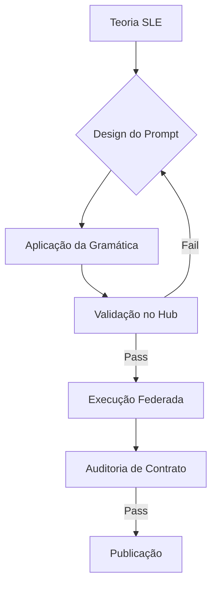

### 📂 Estrutura Revisada da Pasta `/docs`

```text
docs/
├── README.md                # O Guia de Navegação (Este arquivo)
├── theory/                  # A Nova Física (Capítulos Teóricos)
│   ├── 01_fundamentos.md    # A Álgebra da Intenção e o Espaço Latente
│   ├── 02_engenharia.md     # Algoritmos de Densidade (SD) e Contratos (CCC)
│   └── 03_interface.md      # A Gramática Operacional (Sintaxe >>, @, //)
├── manuals/                 # Guias Práticos e Protocolos
│   ├── prompt_engineering.md # Como escrever prompts que passam no validador
│   ├── agent_design.md       # Como projetar Personas/Contratos robustos
│   ├── research_protocol.md  # O fluxo "Zero to Hero" (Pesquisa -> Curadoria -> Convite)
│   └── notebook_workflow.md  # Manual de operação do NotebookLM e Colab
└── glossary.md              # Glossário Técnico (SLE Terminology)
```

# 🧭 Documentação Oficial — Linguistic Laboratory Framework

> **Manual de Operações para Engenharia Semântica Latente (SLE) e Validação Científica.**

Bem-vindo ao núcleo teórico do laboratório. Aqui transformamos a "arte" de conversar com IAs na "ciência" de orquestrar vetores.

---

## 📚 Trilha de Aprendizado (Roadmap)

Recomendamos a leitura nesta ordem para compreender o sistema desde a física até a prática operacional.

### 🧠 Parte 1: A Teoria (Semantic Latent Engineering)
A base matemática que diferencia este laboratório de um chat comum.

* **[01. Fundamentos Físicos](./theory/01_fundamentos.md):** Entenda como a "Álgebra da Intenção" ($I_{\Lambda}$) e o Pipeline Federado substituem a engenharia de prompts tradicional.
* **[02. Engenharia de Validação](./theory/02_engenharia.md):** A matemática por trás da Densidade Semântica (SD) e dos Contratos de Comportamento (CCC).
* **[03. Gramática Operacional](./theory/03_interface.md):** Aprenda a sintaxe de comando (`>>`, `@`, `//`) para controlar o sistema.

### 🛠️ Parte 2: A Prática (Manuais Operacionais)
Como executar o trabalho no dia a dia.

* **[Protocolo de Pesquisa](./manuals/research_protocol.md):** O guia passo-a-passo para iniciar uma investigação do zero (Mineração -> Curadoria -> Convite).
* **[Workflow de Notebooks](./manuals/notebook_workflow.md):** A distinção crucial entre o Notebook de Grounding (Leitura) e o Notebook de Execução (Validação).
* **[Engenharia de Prompts Validada](./manuals/prompt_engineering.md):** Como escrever instruções que recebem Badge Verde no Scientific Validation Hub.
* **[Design de Agentes](./manuals/agent_design.md):** Como projetar Personas estáveis que não sofrem "Drift" (alucinação).

---

## 🧩 Onde se encaixa a Validação?

O fluxo não é linear; é cíclico e validado a cada etapa.


---
