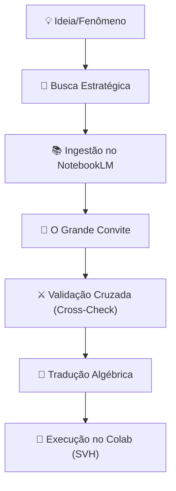

# 📘 Manual de Protocolo de Pesquisa Federada

> **O fluxo "Zero to Hero". Como transformar uma curiosidade em um projeto científico auditável usando IAs gratuitas.**

-----

## 1\. O Ciclo de Vida da Investigação

O Laboratório segue um fluxo linear de enriquecimento de informação. Não começamos codificando; começamos curando.



-----

## 2\. Fase 1: A Busca Estratégica (Mineração)

O objetivo é separar o sinal (Ciência/Realidade) do ruído (Marketing/Hype). Usamos um "Trivium" de ferramentas:

| Ferramenta | Função Específica | O que ela filtra? |
| :--- | :--- | :--- |
| **[Consensus.app](https://consensus.app)** | **Ciência Pura.** Busca apenas dentro de papers revisados por pares. | Elimina blogs, notícias e opiniões. |
| **Perplexity (Academic)** | **Varredura Acadêmica.** Busca papers e pre-prints. | Elimina SEO e marketing de produto. |
| **Grok (X/Reddit)** | **Realidade do Usuário.** Busca em discussões reais de humanos. | Elimina a "teoria perfeita" que não funciona na prática. |
| **Hacker Semântico** | **Agente de Filtro.** Seu agente personalizado. | Rejeita 99% do "fluff" corporativo. |

> **Saída desta fase:** Uma lista de URLs limpos e PDFs de alta relevância. Nada de lixo.

-----

## 3\. Fase 2: Aterramento no NotebookLM (A Biblioteca)

Não jogue os PDFs no chat do GPT (ele esquece). Jogue no **NotebookLM**. Ele é a memória persistente do projeto.

### 3.1 A Estratégia "10+10" (Engenharia de Exploração)

Para extrair o máximo das fontes, aplicamos um padrão de 20 prompts sequenciais:

  * **Os 10 Pilares (Canônicos):**
      * Prompt 1-10: "Quais são os axiomas? Quais as definições matemáticas? Quais as limitações citadas pelos autores?..."
  * **Os 10 Passos (Futuro):**
      * Prompt 11-20: "Baseado nas limitações, qual o próximo passo lógico? Como adaptar isso para o cenário X?..."

> **Resultado:** Um relatório denso, infográficos e um mapa mental do estado da arte.

-----

## 4\. Fase 3: O "Convite" (Orquestração)

Aqui nasce o Laboratório Federado. Você não dá ordens; você convida parceiros.
Abra abas para: **ChatGPT, Claude, Gemini, DeepSeek, Grok**.

### 📜 O Prompt do Convite (Template)

Cole este prompt em todas as IAs para iniciar a sessão:

```markdown
# ✉️ CONVITE PARA COLABORAÇÃO CIENTÍFICA

Olá. Você está sendo convidado para integrar um Comitê Científico Federado.
**O Projeto:** [Descrever o Fenômeno/Problema]
**Sua Função:** [Definir a Persona, ex: Matemático Rigoroso]
**Seus Parceiros:** Você colaborará com Claude (Estrutura), Gemini (Exploração) e Grok (Teste).

**Regras de Engajamento:**
1. **Base de Verdade:** Use apenas os dados que fornecerei do NotebookLM. Não alucine.
2. **Linguagem:** Desenvolva o raciocínio em ÁLGEBRA/LÓGICA primeiro, texto depois.
3. **Validação Cruzada:** Eu trarei críticas dos outros modelos. Você deve refutar ou aceitar matematicamente.
4. **Objetivo Final:** Gerar um código Python validado para o usuário rodar no Google Colab.

**Entrada Inicial (Do NotebookLM):**
[Colar o Resumo/Axiomas aqui]

Você aceita o desafio? Aguarde meu próximo input com a crítica do parceiro.
```

-----

## 5\. Fase 4: Validação Cruzada e Álgebra

Nesta fase, você atua como o "pombo-correio" inteligente.

1.  **ChatGPT gera uma tese.**
2.  **Você copia e cola no Claude:** *"O ChatGPT propôs isso. Encontre falhas estruturais."*
3.  **Você copia a crítica e cola no DeepSeek:** *"O Claude apontou falha lógica. Converta o argumento para Álgebra e verifique quem está certo."*
4.  **Você copia a fórmula e cola no Grok:** *"Gere um teste unitário (Sandbox) para provar essa fórmula."*

> **A Mágica:** Ao forçar as IAs a conversarem em **Álgebra**, a ambiguidade da linguagem natural desaparece. A equação é o protocolo universal.

-----

## 6\. Fase 5: O Produto Final (Github)

Quando a equação fecha e o código roda no Sandbox do Grok/GPT:

1.  Leve o código final para o **Google Colab**.
2.  Use o **Scientific Validation Hub** (Notebooks SD/CCC) para validar se o agente final está denso.
3.  Salve no **GitHub** como um novo repositório ou ferramenta.
4.  **Ciclo Fechado:** O output vira input para o próximo pesquisador.

-----

### Resumo para o Usuário

Este método permite que um estudante com um laptop velho e zero orçamento produza ciência com o mesmo rigor (ou maior) que um departamento de R\&D, usando a inteligência coletiva das maiores IAs do mundo, moderadas pela matemática.
