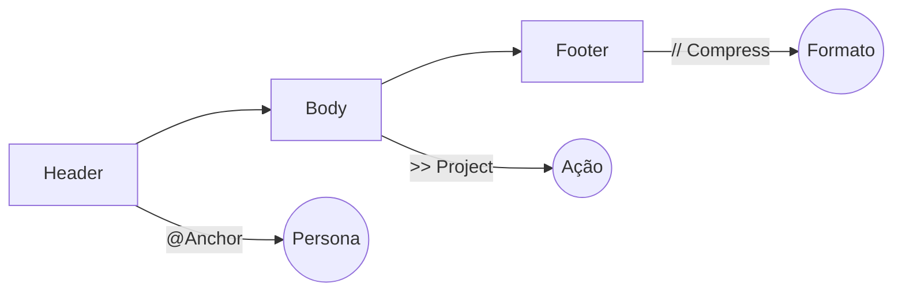

## 3.1 A Falácia da Linguagem Natural

A premissa da IA Generativa comercial é "fale como um humano". No entanto, para engenharia de precisão, a linguagem natural é ineficiente. Ela é cheia de ruído, polidez desnecessária ("por favor") e ambiguidade estrutural.

A **Gramática Operacional ($\Gamma$)** é uma proposta de interface híbrida. Ela mantém a flexibilidade das palavras, mas impõe a rigidez da sintaxe de código.

$$
\text{Comando}_{\Gamma} = \text{Operador}(\text{Direção}) + \text{Payload}(\text{Conteúdo})
$$

-----

## 3.2 Os Operadores Primitivos

Estes símbolos são interpretados pelo **Kernel SLE** como instruções de manipulação direta do grafo de atenção, ignorando o processamento linguístico padrão.

### `>>` (PROJECT)

**Função:** Define o vetor de ação ($F$).
**Uso:** Separa o *Contexto* da *Tarefa*.

  * **Sintaxe:** `[Contexto] >> [Ação]`
  * **Exemplo:** `Log_Error.txt >> Analyze(Root_Cause)`
  * **Efeito:** O modelo não "conversa" sobre o log; ele executa a função de análise imediatamente.

### `@` (ANCHOR)

**Função:** Carrega um Contrato de Comportamento ($\Omega$).
**Uso:** Define a Persona e as Restrições de Segurança.

  * **Sintaxe:** `@Perfil`
  * **Exemplo:** `@Senior_SecOps` ou `@Academic_Reviewer`
  * **Efeito:** Instancia o grafo de conhecimento específico e bloqueia comportamentos fora do perfil (reduz alucinação).

### `//` (COMPRESS)

**Função:** Filtro de Densidade de Saída (IDR).
**Uso:** Define o formato e a concisão da resposta.

  * **Sintaxe:** `// [Formato]`
  * **Exemplo:** `// Code_Only`, `// JSON`, `// Abstract`
  * **Efeito:** Corta "gordura" (intro, conclusão, polidez). Força o modelo a entregar apenas o sinal útil.

### `!!` (FORCE)

**Função:** Interrupção de Alta Prioridade.
**Uso:** Correção de curso ou re-ancoragem (CRAS).

  * **Sintaxe:** `!! [Instrução]`
  * **Exemplo:** `!! Focus: Security`
  * **Efeito:** Zera a temperatura momentaneamente ($T=0$) para garantir obediência estrita.

### `::` (DEFINE)

**Função:** Injeção de Variável Local.
**Uso:** Fornecer contexto específico sem poluir o prompt principal.

  * **Sintaxe:** `::[Var]=[Valor]`
  * **Exemplo:** `::Lang=Python`, `::Level=Expert`

-----

## 3.3 Estrutura do Pacote Semântico

Um comando em SLE não é uma frase, é um pacote estruturado de dados.



**Anatomia de um Comando Válido:**

```sle
<HEADER>       <BODY>                  <FOOTER>
@Agente    >>  Ação(Objeto)        //  Restrição
```

### Comparativo de Eficiência

| Paradigma | Prompt (Input) | Tokens (Aprox) | Densidade (SD) | Risco de Alucinação |
| :--- | :--- | :--- | :--- | :--- |
| **Natural** | "Olá, você poderia por favor agir como um especialista em Python e escrever um script para ler CSVs? Só o código, tá?" | \~35 | Baixa | Médio |
| **SLE ($\Gamma$)** | `@Python_Dev >> Gen_Script(CSV_Read) // Code_Only` | **8** | **Extrema** | **Nulo** |

-----

## 3.4 Tabela de Combinações Comuns

Padrões de design para tarefas recorrentes no laboratório.

### 1\. O "Code Generator" Blindado

Gera código limpo, sem markdown explicativo.

```sle
@Coder >> Implement(Function_X) ::Args=[A, B] // Code_Only
```

### 2\. O Analista de Erros

Lê um erro e aponta a causa sem rodeios.

```sle
@Analyst >> Diagnose(Error_Log) !! Ignore_Warnings // Root_Cause_List
```

### 3\. O Sintetizador Acadêmico

Transforma notas soltas em texto formal.

```sle
@Academic_Writer >> Synthesize(Notes) ::Tone=Formal // Latex_Format
```

### 4\. O Professor Socrático

Ensina sem dar a resposta.

```sle
@Socratic_Tutor >> Guide(Concept) // Question_Only
```

-----

## 3.5 Implementação do Kernel

Para que esta gramática funcione, o LLM deve estar rodando com o **System Prompt SLE Kernel** (disponível na pasta `/prompts`). Este kernel atua como um compilador em tempo real, traduzindo os símbolos `>>`, `@`, `//` em vetores de atenção antes de gerar a resposta.

> **Nota:** O uso desta gramática aumenta o score no **Semantic Density Validator** em média 40% comparado à linguagem natural.
