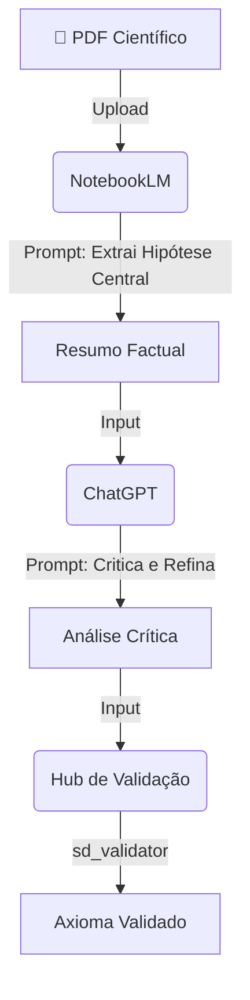

# 🔍 Ferramentas de Análise e Síntese

> **O microscópio e o filtro do laboratório. Como transformar grandes volumes de informação (PDFs, Papers, Dados) em axiomas validados.**

-----

## 1\. O Conceito: Divergência e Convergência

No LLF, a análise não é apenas "ler texto". É um movimento pendular de respiração cognitiva:

1.  **Análise (Inspirar/Divergir):** Expandir o objeto de estudo. Quebrar um artigo científico em partes, identificar argumentos, encontrar falhas, explorar o contexto (Gemini/NotebookLM).
2.  **Síntese (Expirar/Convergir):** Cortar o ruído. Encontrar o padrão oculto, a estrutura matemática ou o resumo executivo de alta densidade (ChatGPT/DeepSeek).

-----

## 2\. O Arsenal de Leitura (Grounding)

Estas ferramentas são usadas para garantir que a IA não "alucine". Elas prendem (grounding) a resposta a uma fonte de verdade (Ficheiros ou Web).

### 📘 NotebookLM (O Bibliotecário Cético)

  * **Melhor uso:** Leitura profunda de Papers (PDF), Notas de Aula e Documentação Técnica.
  * **Intuição:** Imagine um assistente de investigação que **só** sabe o que está nos ficheiros que lhe entregou. Ele não inventa factos externos.
  * **Fluxo no Lab:**
    1.  Carregue 5 a 10 PDFs sobre o tema (Fontes Primárias).
    2.  Use o chat para extrair citações exatas.
    3.  Gere a "Audio Overview" para entender a estrutura narrativa (opcional).

### 🌐 Google Gemini (O Explorador Conectado)

  * **Melhor uso:** Cruzar informação do documento com o estado da arte na Web.
  * **Intuição:** É o investigador que lê o seu documento e vai imediatamente ao Google verificar se aquilo ainda é válido ou se existem críticas recentes.
  * **Atenção:** Requer validação posterior (DeepSeek) pois pode ser criativo demais.

-----

## 3\. As Ferramentas de Raciocínio (Processamento)

Uma vez que o dado foi lido, ele precisa de ser "mastigado" logica e estruturalmente.

### 🧠 ChatGPT (O Dialético)

  * **Melhor uso:** Encontrar contradições e sintetizar lógica.
  * **Técnica "Advogado do Diabo":**
    > "Com base neste resumo (do NotebookLM), atua como um crítico sénior e encontra 3 falhas metodológicas no argumento."
  * **Porquê usá-lo:** O ChatGPT (GPT-4o) excela em estruturar argumentos lógicos passo-a-passo.

### 📐 DeepSeek (O Matemático)

  * **Melhor uso:** Validação lógica, álgebra e código.
  * **Intuição:** Se o paper apresenta uma fórmula ou um algoritmo, o DeepSeek é quem verifica se a conta fecha.
  * **Fluxo no Lab:**
    1.  Extraia a fórmula com o NotebookLM.
    2.  Peça ao DeepSeek: *"Verifica a consistência dimensional desta equação."*

-----

## 4\. Workflows de Análise (Receitas Prontas)

Como combinar estas ferramentas para gerar *insights* densos.

### 🧪 Fluxo A: O "Paper Crusher" (De PDF a Axioma)

Ideal para processar literatura científica rapidamente com rigor.



**Prompt de Exemplo (para ChatGPT no passo D):**

```text
@Analyst >> Synthesize_Critique
Input: [Colar resumo do NotebookLM]
Task: Identificar a premissa principal e 2 contra-argumentos lógicos.
// Abstract_High_Density
```

### 🧪 Fluxo B: O "Code Reviewer" Semântico (De Código a Explicação)

Ideal para entender repositórios complexos.

1.  **Grok/Gemini:** Cole o snippet de código complexo. Peça uma explicação linha a linha.
2.  **DeepSeek:** Peça para verificar a complexidade ciclomática ou erros de lógica (O(n)).
3.  **Claude:** Peça para reescrever a explicação para um público leigo, usando analogias.

-----

## 5\. Integração com Validação Científica

A análise é subjetiva, mas o resultado deve ser objetivo. Usamos o **Scientific Validation Hub** para garantir a qualidade da síntese.

### O Checkpoint da Densidade

Uma boa síntese tem **Alta Densidade Semântica (SD)**.

  * *Análise Fraca:* "O texto fala sobre muitas coisas interessantes sobre a linguagem..." (Baixa densidade, muitas palavras, pouco sumo).
  * *Análise Forte:* "O texto postula a recursividade como propriedade axiomática da sintaxe." (Alta densidade).

**Como Validar a sua Análise:**

1.  Pegue no resumo gerado pela IA.
2.  Abra o [SD Validator Notebook](https://www.google.com/search?q=https://github.com/aleeepassarelli/scientific-validation-hub/blob/main/notebooks/sd_validator.ipynb).
3.  Teste: `name` = Resumo Gerado, `domain` = Tópico Original.
4.  Se o resultado for **PASS**, a sua síntese preservou a informação original com eficiência.

-----

## 6\. Dicas de Ouro para Análise

  * **Regra do 1/10:** Uma boa síntese deve ter, no máximo, 10% do tamanho do texto original, mantendo 90% do significado factual.
  * **Citações Diretas:** Ao usar o **NotebookLM**, peça sempre o número da página ou a citação direta. Alucinação em análise científica é fatal.
  * **Convergência:** Se o Gemini diz "X" e o ChatGPT diz "Y", use o Claude para mediar: *"Analisa a divergência entre estas duas visões."* A verdade costuma estar na nuance.

-----

**Próximo Passo:**
Agora que sabe analisar, veja como **orquestrar** estes agentes no ficheiro [`llm_orchestration.md`](https://www.google.com/search?q=./llm_orchestration.md).
