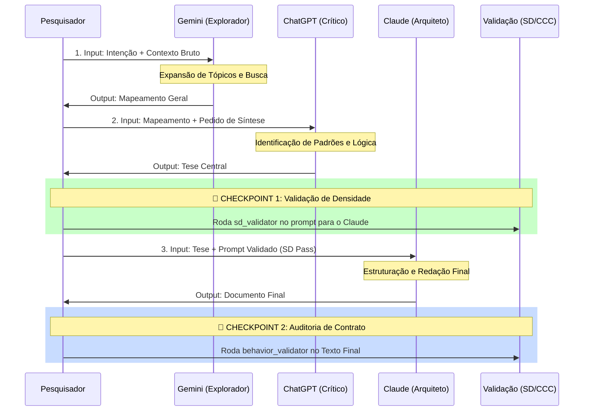

# 🎼 Orquestração Multi-LLM (Federated AI Protocol)

> **Guia operacional para coordenar múltiplas inteligências artificiais em um fluxo de pesquisa coeso, gratuito e validado.**

-----

## 1\. O Conceito de Inteligência Federada

No Linguistic Laboratory Framework (LLF), rejeitamos a ideia de uma "IA Suprema". Em vez disso, operamos com o conceito de **Especialização Funcional**. Tratamos cada modelo (Gemini, Claude, GPT) não como um oráculo, mas como um componente de software com funções específicas de processamento de linguagem.

**A Regra de Ouro:**

> *O output de uma IA é o input da próxima. A qualidade final depende da preservação da Densidade Semântica (SD) durante essas transições.*

-----

## 2\. O Elenco de Especialistas (Free Tier)

Cada modelo é escalado para uma função onde ele supera os outros matematicamente ou arquiteturalmente.

| Agente (IA) | Função no Lab | Por que usar? | Ponto Fraco (Mitigado por) |
| :--- | :--- | :--- | :--- |
| **Gemini** (Google) | **Explorador & Multimodal** | Janela de contexto massiva; Acesso à web em tempo real; Visão computacional. | Alucinação criativa (Validado por DeepSeek). |
| **NotebookLM** | **Bibliotecário (RAG)** | "Grounding" estrito em documentos (PDF/Docs); Zero alucinação fora do contexto. | Não gera raciocínio novo complexo (Expandido por GPT). |
| **ChatGPT** | **Dialético (Crítica)** | Capacidade de síntese; Lógica argumentativa; Refinamento de ideias. | "Preguiça" em textos longos (Estruturado por Claude). |
| **Claude** | **Arquiteto (Escrita)** | Melhor janela de output; Estilo literário natural; Organização hierárquica. | Recusa excessiva (Ajustado por Behavior Contract). |
| **DeepSeek** | **Calculadora Lógica** | Raciocínio matemático; Lógica formal; Geração de código. | Contexto menor (Alimentado por resumos). |

-----

## 3\. O Pipeline de Orquestração (Fluxo SLE)

Este é o padrão oficial de transferência de dados. O fluxo é interrompido por **Checkpoints de Validação** do [Scientific Validation Hub](https://www.google.com/search?q=https://github.com/aleeepassarelli/scientific-validation-hub).



-----

## 4\. Protocolos de Handover (Passagem de Bastão)

O maior risco na orquestração é o **Drift de Contexto** (telefone sem fio). Para evitar isso, usamos "Prompts de Passagem" padronizados.

### 4.1 De Gemini (Exploração) → ChatGPT (Síntese)

O Gemini gera muito texto. O ChatGPT precisa de foco.
**Prompt de Passagem:**

```text
Atue como Sintetizador Lógico.
Abaixo está um relatório exploratório bruto gerado pelo Gemini.
Sua tarefa:
1. Extrair os 3 axiomas principais.
2. Identificar contradições lógicas.
3. Ignorar o texto de preenchimento (fluff).
INPUT: [Colar output do Gemini]
```

### 4.2 De ChatGPT (Síntese) → Claude (Estrutura)

O ChatGPT gera boas listas, mas textos secos. O Claude precisa de estrutura.
**Prompt de Passagem (Deve ser validado no SD):**

```text
@Writer_Architect >> Structure_Document
Input_Data: [Tese do ChatGPT]
Goal: Transformar os axiomas em um artigo acadêmico completo.
Constraint: Manter tom formal, usar headers hierárquicos, sem introduções vazias.
// Markdown_Format
```

-----

## 5\. Integração com Scientific Validation Hub

Nenhuma orquestração está completa sem prova de qualidade. Diferente de outros frameworks, nós não "confiamos" na IA. Nós auditamos.

### Passo A: Validando o Prompt (Antes de gerar o texto)

Antes de pedir para o Claude escrever o texto final, leve seu prompt para o **Semantic Density Validator**:

1.  Acesse o [Notebook SD Validator](https://www.google.com/search?q=https://github.com/aleeepassarelli/scientific-validation-hub/blob/main/notebooks/sd_validator.ipynb).
2.  Cole seu prompt de passagem.
3.  **Meta:** Obter `Scientific Validation: PASSING`. Se der `FAIL`, seu prompt está muito verboso (baixa densidade) e o Claude vai alucinar.

### Passo B: Validando o Resultado (Depois de gerar o texto)

Depois que o Claude entregar o artigo/código, leve para o **Behavior Contract Validator**:

1.  Acesse o [Notebook CCC Validator](https://www.google.com/search?q=https://github.com/aleeepassarelli/scientific-validation-hub/blob/main/notebooks/behavior_validator.ipynb).
2.  Defina o contrato (ex: "Deve ser técnico e neutro").
3.  **Meta:** Obter `Adherence Status: PASS`. Isso garante que a IA não inventou fatos ou mudou o tom no meio do texto.

-----

## 6\. Exemplo Prático: Análise de Poema

**Objetivo:** Analisar a estrutura sintática de um poema clássico.

1.  **NotebookLM:** Carrega o PDF do livro do autor (Grounding). Extrai o poema exato e notas de rodapé.
2.  **ChatGPT:** Recebe o poema. Prompt: *"Analise a métrica e as figuras de linguagem."* (Saída: Lista de fatos analíticos).
3.  **Validação (SD):** Usuário cria prompt para o Claude: *"@Literary\_Critic \>\> Synthesize\_Essay // Academic\_Tone"*. Valida no Hub. (Status: PASS).
4.  **Claude:** Recebe os fatos do ChatGPT + Prompt Validado. Escreve o ensaio final.
5.  **Grok/DeepSeek:** (Opcional) Verifica se a contagem de sílabas poéticas citada está matematicamente correta.

-----

## 7\. Troubleshooting de Orquestração

| Sintoma | Causa Provável | Solução |
| :--- | :--- | :--- |
| **IA ignora instruções anteriores** | Context Window estourada | Resuma o histórico usando o ChatGPT antes de passar para a próxima IA. |
| **Texto final genérico** | Prompt de Passagem fraco | Valide o prompt no **SD Validator**; aumente a densidade semântica. |
| **Alucinação de Fatos** | Falta de Grounding | Volte um passo e use o **NotebookLM** apenas com as fontes primárias. |
| **Mudança brusca de estilo** | Quebra de Persona | Use o **Behavior Validator** para forçar o contrato `@Persona` na input. |

-----

> **Nota:** Este protocolo garante que o "Humano no Loop" atue como um **Gerente de Qualidade**, não como um redator. As IAs produzem, o Humano valida (via Hub), e o processo avança.

