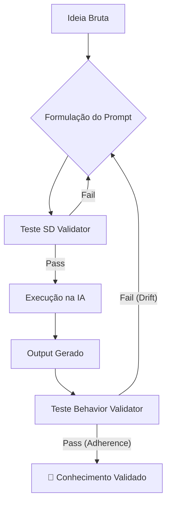

# 🛡️ Ferramentas de Validação e Epistemologia

> **Onde a Engenharia de Software encontra a Filosofia da Ciência. Regras, métodos e ferramentas para garantir que a IA produza conhecimento, não alucinação.**

-----

## 1\. O Problema Epistemológico da IA

Grandes Modelos de Linguagem (LLMs) são, por definição, **motores probabilísticos de plausibilidade**, não motores de verdade. Eles são treinados para gerar o "próximo token mais provável", o que frequentemente resulta em textos que parecem verdadeiros, mas são factualmente ou estruturalmente falsos (Alucinação).

No **Linguistic Laboratory Framework (LLF)**, resolvemos isso impondo uma camada de **Verificação Externa**.

**A Regra de Ouro:**

> *"A confiança não é uma métrica. A métrica é a aderência vetorial."*

-----

## 2\. Os 3 Princípios Epistemológicos (Regras do Lab)

Para que um experimento seja considerado "Válido" neste laboratório, ele deve satisfazer três princípios fundamentais.

### 📐 I. Princípio da Densidade Semântica (SD)

*A verdade é densa. A mentira (ou o preenchimento) é entrópica.*

Se um prompt ou resposta precisa de muitas palavras para transmitir um conceito simples, ele tem **baixa densidade**. Isso indica ruído no espaço latente e alta probabilidade de desvio.

  * **Ferramenta:** Semantic Density Validator.
  * **Critério:** O vetor do texto gerado deve ter alta similaridade de cosseno com o vetor da intenção original.

### ⚖️ II. Princípio da Aderência Contratual (CCC)

*A identidade é estabilidade. A inconsistência é falha.*

Um Agente (Persona) estabelece um "Contrato" com o usuário (ex: "Serei técnico e cético"). Se, durante a resposta, o agente se torna "amigável e superficial", houve uma quebra de contrato (Drift).

  * **Ferramenta:** Behavior Contract Validator.
  * **Critério:** A distância vetorial entre a Missão e o Output não pode exceder o limiar de tolerância (Threshold).

### 🔄 III. Princípio da Reprodutibilidade Computacional

*Se não roda na máquina de outro, não é ciência.*

Um resultado obtido via chat manual não é confiável. Um resultado obtido via código/prompt versionado é.

  * **Ferramenta:** Scientific Validation Hub (Labs).
  * **Critério:** O experimento deve ser empacotado (Notebook/DVC) de forma que qualquer pessoa possa obter o mesmo resultado.

-----

## 3\. As Ferramentas Nativas (Scientific Validation Hub)

Integramos o [Scientific Validation Hub](https://www.google.com/search?q=https://github.com/aleeepassarelli/scientific-validation-hub) diretamente no fluxo de pesquisa. Estas ferramentas rodam no **Google Colab**, garantindo acesso gratuito e universal.

| Ferramenta | O que ela valida? (Epistemologia) | Link de Execução |
| :--- | :--- | :---: |
| **🔍 Semantic Density (SD)** | **Precisão:** O prompt está "afiado" ou "cego"? |  |
| **🧠 Behavior Contract (CCC)** | **Coerência:** O agente manteve a palavra? |  |
| **🧪 Lab Notebooks** | **Reprodutibilidade:** O experimento é sólido? | [Acessar Hub](https://www.google.com/search?q=https://github.com/aleeepassarelli/scientific-validation-hub) |

-----

## 4\. Metodologia de Uso (O Ciclo de Verdade)

Não validamos apenas no final. A validação é cíclica.

### Passo 1: Validação a Priori (Input)

Antes de rodar um experimento complexo, teste o seu Prompt no **SD Validator**.

  * **Objetivo:** Eliminar ambiguidade.
  * **Meta:** Badge Verde (`Scientific Validation: PASSING`).

### Passo 2: Validação a Posteriori (Output)

Pegue a resposta da IA e confronte-a com a sua intenção original no **Behavior Validator**.

  * **Objetivo:** Detectar alucinação sutil ou mudança de tom.
  * **Meta:** Badge Verde (`Adherence Status: PASS`).

-----

## 5\. Interpretando os Resultados

O que significam os badges no contexto científico?

### ✅ PASS / EXCELLENT

  * **Significado:** O vetor do resultado está matematicamente alinhado com o vetor da intenção.
  * **Conclusão:** O resultado é confiável para publicação ou uso em produção. A "Geometria do Espaço Latente" foi respeitada.

### ⚠️ FAIL (Low Density)

  * **Significado:** O modelo "encheu linguiça". Usou muitas palavras para dizer pouco, ou diluiu o comando original.
  * **Ação:** Reescreva o prompt usando operadores de compressão (ex: `// Code_Only` ou listas).

### 🚨 FAIL (Contract Drift)

  * **Significado:** O modelo esqueceu quem era. Ignorou restrições de segurança ou de formato.
  * **Ação:** O prompt precisa de "Re-Ancoragem" (CRAS). Aumente a penalidade no contrato ou use `!! Force` na sintaxe.

-----

## 6\. Referências Epistemológicas

A base teórica destas ferramentas deriva de:

1.  **Semantic Folding Theory:** A ideia de que significados são coordenadas topológicas.
2.  **Information Theory (Shannon):** A relação entre sinal (intenção) e ruído (alucinação).
3.  **Active Inference:** O agente deve minimizar a "surpresa" (erro) em relação ao seu modelo interno (contrato).

> *"No LLF, a validação não é uma etapa burocrática. É a garantia de que estamos fazendo ciência, e não apenas conversando com chatbots."*
